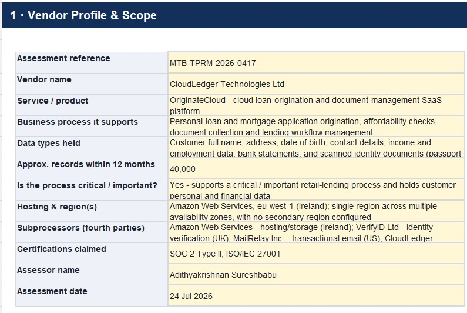
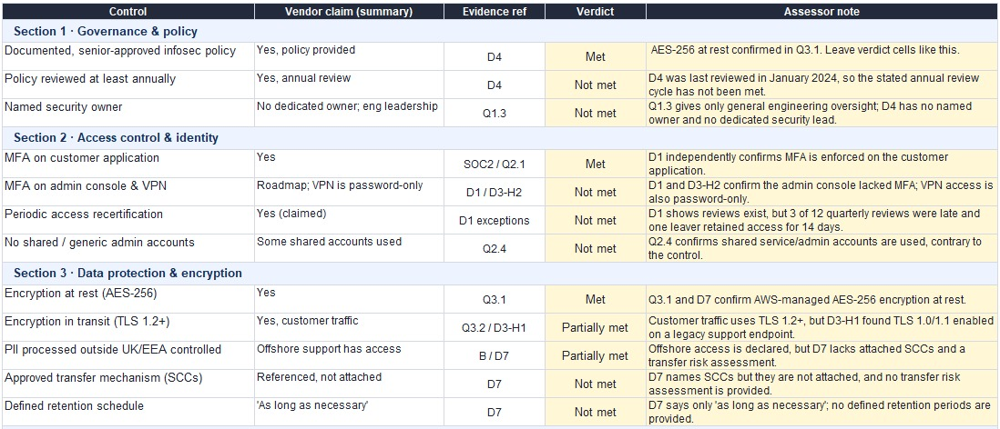
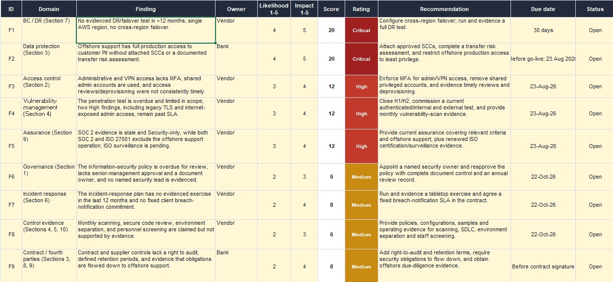
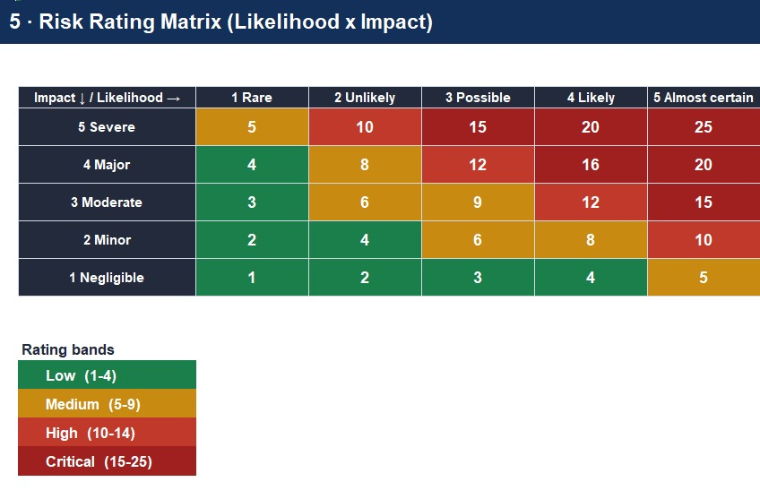
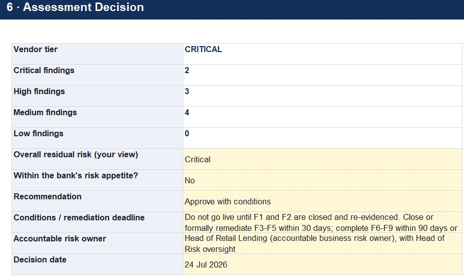

# Third-Party Vendor Risk Assessment

## Overview

This project demonstrates an end-to-end Third-Party Risk Management assessment of a fictional SaaS vendor being considered by a regulated bank.

CloudLedger Technologies provides the OriginateCloud loan-origination platform, which processes sensitive customer PII and financial information and supports an important lending process.

The objective of the assessment was to determine the vendor's inherent risk, evaluate its control environment against supporting evidence, identify material gaps, assess residual risk, and provide a practical vendor risk recommendation.

---

## Methodology

The assessment followed a structured Third-Party Risk Management process.

### 1. Vendor Scoping

I first reviewed:

- the service being provided
- the sensitivity of the data processed
- the business criticality of the service
- regulatory exposure
- system and production data access
- fourth-party and subprocessor dependencies

### 2. Inherent Risk Tiering

The vendor was scored across four inherent risk factors:

- Data Sensitivity
- Operational Criticality
- Regulatory Exposure
- System and Data Access

These factors produced a weighted inherent risk score of:

**4.85 / 5.00**

Based on this score, CloudLedger was classified as a:

**Critical Vendor**

### 3. Control Assessment

I assessed the vendor across 10 security and risk domains:

1. Governance, Risk and Security Policy
2. Access Control and Identity
3. Data Protection and Encryption
4. Vulnerability and Patch Management
5. Secure Development and Change Management
6. Logging, Monitoring and Incident Response
7. Business Continuity, Disaster Recovery and Resilience
8. Fourth-Party and Subcontractor Management
9. Compliance, Certifications and Assurance
10. Physical and Personnel Security

Vendor questionnaire responses were reviewed against supporting evidence including:

- SOC 2 Type II assurance
- ISO/IEC 27001 certification
- penetration testing results
- security policies
- incident response documentation
- business continuity and disaster recovery documentation
- contractual and data protection evidence

Controls were assessed as:

- Met
- Partially Met
- Not Met
- Not Applicable

### 4. Risk Scoring

Identified control gaps were consolidated into risk findings.

Each finding was scored using:

**Likelihood x Impact**

Both likelihood and impact were rated on a scale of 1 to 5.

Risk ratings were determined as:

- Low: 1–4
- Medium: 5–9
- High: 10–14
- Critical: 15–25

For example, a likelihood score of 4 and an impact score of 5 resulted in a risk score of:

**20 – Critical**

---

## Key Findings

The assessment identified nine consolidated findings.

### F1 – Business Continuity and Disaster Recovery
**Critical**

The service operated within a single AWS region, with no evidenced cross-region failover capability and no recent full disaster recovery test.

### F2 – Offshore Processing and International Data Transfer
**Critical**

Offshore support personnel could access production customer data, but the international transfer safeguards and supporting controls were not fully evidenced.

### F3 – Privileged Access and Identity Management
**High**

The assessment identified weaknesses including missing MFA on administrative access, shared privileged accounts, delayed access reviews, and delayed deprovisioning.

Other findings were identified across vulnerability management, independent assurance, governance, incident response, control evidence, and contractual and fourth-party risk.

---

## Assessment Outcome

- Vendor Tier: **Critical**
- Inherent Risk Score: **4.85 / 5.00**
- Critical Findings: **2**
- High Findings: **3**
- Medium Findings: **4**
- Residual Risk: **Critical**
- Risk Appetite: **Outside Appetite**
- Recommendation: **Approve with Conditions**

### Why Approve with Conditions?

The recommendation does not mean the vendor can immediately enter production.

CloudLedger may continue through the onboarding process, but:

**Production go-live must not occur until Critical Findings F1 and F2 are closed and re-evidenced.**

The recommendation balances the business need for the service with Meridian's risk appetite by allowing the relationship to progress while preventing production use until the most significant risks have been addressed.

---

## Vendor Profile

The vendor profile was used to document the service, data processed, hosting model, business criticality, certifications, and fourth-party dependencies before completing the inherent risk assessment.

---

## Control Assessment

This screenshot shows a representative extract from the control assessment.

The full assessment covered 10 security and risk domains, with vendor responses reviewed against supporting evidence before assigning a control verdict.

The purpose was not simply to accept the vendor's questionnaire responses, but to determine whether the available evidence supported each claim.

---

## Risk Findings

The findings register consolidates identified control weaknesses into risk findings and records:

- finding description
- risk owner
- likelihood
- impact
- risk score
- risk rating
- recommended treatment
- target date
- status

---

## Risk Rating Matrix

The risk matrix was used to consistently rate each finding based on likelihood and impact.

---

## Final Decision

The final assessment determined that residual risk remained Critical and outside the bank's stated risk appetite.

The recommended decision was:

**Approve with Conditions**

However, production go-live remains blocked until the two Critical findings are remediated and satisfactory closure evidence is reviewed.

---

## Project Files

The completed assessment workbook can be viewed here:

[View the Vendor Risk Assessment Workbook](Vendor_Risk_Assessment_Workbook.xlsx)

The workbook contains six main assessment sheets:

1. Vendor Profile
2. Tiering
3. Questionnaire
4. Findings
5. Risk Matrix
6. Decision

These sheets document the full assessment process from initial vendor scoping through to the final risk recommendation.

---

## Skills Demonstrated

- Third-Party Risk Management
- Vendor Risk Assessment
- Governance, Risk and Compliance
- Inherent Risk Assessment
- Residual Risk Assessment
- Risk Appetite
- Control Assessment
- Evidence Review
- SOC 2 Review
- ISO/IEC 27001 Assurance Review
- Vulnerability and Penetration Test Review
- Risk Scoring
- Risk Register Development
- Remediation Planning
- Fourth-Party Risk
- Business Continuity and Disaster Recovery Risk
- Executive Risk Communication

---

## Disclaimer

This project is based on a fictional training scenario and is intended solely to demonstrate practical Governance, Risk and Compliance and Third-Party Risk Management skills.

[View the Vendor Risk Assessment Workbook](Vendor_Risk_Assessment_Workbook_TPRM.xlsx)
